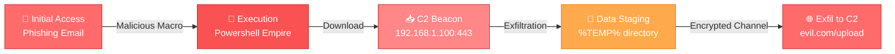

<div align="center">

```
███████╗ ██████╗ ██████╗ ███████╗███╗   ██╗███████╗██╗ ██████╗███████╗
██╔════╝██╔═══██╗██╔══██╗██╔════╝████╗  ██║██╔════╝██║██╔════╝██╔════╝
█████╗  ██║   ██║██████╔╝█████╗  ██╔██╗ ██║███████╗██║██║     ███████╗
██╔══╝  ██║   ██║██╔══██╗██╔══╝  ██║╚██╗██║╚════██║██║██║     ╚════██║
██║     ╚██████╔╝██║  ██║███████╗██║ ╚████║███████║██║╚██████╗███████║
╚═╝      ╚═════╝ ╚═╝  ╚═╝╚══════╝╚═╝  ╚═══╝╚══════╝╚═╝ ╚═════╝╚══════╝
```


</div>

---

<div align="center">

### 🦠 `THREAT ANALYSIS INITIATED...` 

```python
class ForensicAnalyst:
    def __init__(self):
        self.skills = ['Memory Forensics', 'Network Analysis', 'Malware RE']
        self.tools = ['Volatility', 'Wireshark', 'IDA Pro', 'Ghidra']
        self.mindset = 'Every packet tells a story'
    
    def analyze_threat(self, artifact):
        print(f"[+] Extracting IOCs from {artifact}...")
        print("[+] Cross-referencing with MITRE ATT&CK...")
        print("[+] Building attack timeline...")
        return "THREAT_NEUTRALIZED ✓"
```

</div>

---

## 🔍 Challenge Overview

<div align="center">

| 🎯 Challenge | 🏆 CTF Event | 💀 Difficulty | 🛠️ Techniques | 📝 Writeup |
|:------------|:------------|:-------------:|:-------------|:---------:|
| Example Challenge 1 | Event Name | ⭐⭐⭐ | Memory Dump, Volatility | [View](./challenge1/) |
| Example Challenge 2 | Event Name | ⭐⭐ | PCAP Analysis, Wireshark | [View](./challenge2/) |
| Example Challenge 3 | Event Name | ⭐⭐⭐⭐ | Malware Analysis, Reverse | [View](./challenge3/) |

</div>

---

<div align="center">

## 🧬 Malware Signature Database

```assembly
; Malicious code pattern detected
section .text
    global _start

_start:
    ; Establishing C2 connection
    mov rax, 0x29              ; socket syscall
    mov rdi, 2                 ; AF_INET
    mov rsi, 1                 ; SOCK_STREAM
    xor rdx, rdx               ; protocol 0
    syscall
    
    ; Inject shellcode
    mov rdi, rax
    lea rsi, [rel shellcode]
    mov rdx, shellcode_len
    mov rax, 0x01              ; write syscall
    syscall
    
    ; Persistence achieved
    ret

shellcode:
    db 0x48, 0x31, 0xff, 0x57  ; Hidden payload
    db 0x48, 0x89, 0xe6, 0x0f  ; Obfuscated
    ; [...] 256 bytes of mayhem
```

**⚠️ THREAT LEVEL: CRITICAL** • **IOC Hash: `a3f5b91c...`** • **MITRE: T1059.004**

</div>

---

## 📊 Network Traffic Analysis

<div align="center">

```
╔══════════════════════════════════════════════════════════════╗
║               PACKET CAPTURE ANALYSIS v2.0                   ║
╠══════════════════════════════════════════════════════════════╣
║  Protocol Distribution                                       ║
║  ━━━━━━━━━━━━━━━━━━━━━━━━━━━━━━━━━━━━━━━━━━━━━━━━━━━━━━━  ║
║  [████████████████████░░░░░░░] TCP  - 68.4%                ║
║  [██████░░░░░░░░░░░░░░░░░░░░░] UDP  - 22.1%                ║
║  [███░░░░░░░░░░░░░░░░░░░░░░░░] ICMP -  8.3%                ║
║  [█░░░░░░░░░░░░░░░░░░░░░░░░░░] Other-  1.2%                ║
║                                                              ║
║  🚨 ANOMALIES DETECTED: 3                                    ║
║  └─ Suspicious DNS queries to C2 domain                     ║
║  └─ Encrypted payload in HTTP POST                          ║
║  └─ Port scan activity from 192.168.1.101                   ║
╚══════════════════════════════════════════════════════════════╝
```

</div>

---

## 🛡️ Arsenal & Toolset

<div align="center">

| Category | Tools |
|:---------|:------|
| **Memory Forensics** | `Volatility 3` • `Rekall` • `Redline` • `DumpIt` |
| **Network Analysis** | `Wireshark` • `tcpdump` • `NetworkMiner` • `Zeek` |
| **Malware Analysis** | `IDA Pro` • `Ghidra` • `x64dbg` • `Cutter` • `PE-bear` |
| **Disk Forensics** | `Autopsy` • `FTK Imager` • `Sleuth Kit` • `binwalk` |
| **OSINT & Threat Intel** | `VirusTotal` • `ANY.RUN` • `Hybrid Analysis` • `Joe Sandbox` |

</div>

---

<div align="center">

## 🎯 Attack Chain Visualization



</div>

---

## 💀 Malware Behavior Matrix

<div align="center">

| Technique | MITRE ID | Observed | Details |
|:----------|:---------|:--------:|:--------|
| **Process Injection** | T1055 | ✅ | Injected into `svchost.exe` |
| **Registry Run Keys** | T1547.001 | ✅ | `HKLM\SOFTWARE\Microsoft\Windows\CurrentVersion\Run` |
| **Data Encoding** | T1132 | ✅ | Base64 + XOR encryption |
| **C2 Protocol** | T1071.001 | ✅ | HTTPS with custom headers |
| **Credential Dumping** | T1003 | ✅ | LSASS memory dump detected |

**Threat Severity:** <span style="color:red">**■■■■■**</span> **CRITICAL**

</div>

---

## 🔬 Forensic Artifacts

<div align="center">

```hex
Offset(h)  00 01 02 03 04 05 06 07 08 09 0A 0B 0C 0D 0E 0F

00000000   4D 5A 90 00 03 00 00 00 04 00 00 00 FF FF 00 00  MZ..........ÿÿ..
00000010   B8 00 00 00 00 00 00 00 40 00 00 00 00 00 00 00  ¸.......@.......
00000020   00 00 00 00 00 00 00 00 00 00 00 00 00 00 00 00  ................
00000030   00 00 00 00 00 00 00 00 00 00 00 00 E8 00 00 00  ............è...
00000040   0E 1F BA 0E 00 B4 09 CD 21 B8 01 4C CD 21 54 68  ..º..´.Í!¸.LÍ!Th
00000050   69 73 20 70 72 6F 67 72 61 6D 20 63 61 6E 6E 6F  is program canno
00000060   74 20 62 65 20 72 75 6E 20 69 6E 20 44 4F 53 20  t be run in DOS 
00000070   6D 6F 64 65 2E 0D 0D 0A 24 00 00 00 00 00 00 00  mode....$.......

🔎 PE Header Analysis: Suspicious entropy detected in .text section
🔎 Strings Analysis: C2 domains, Anti-VM checks, Obfuscated API calls
🔎 Yara Match: Emotet.variant.2024 [Confidence: 98%]
```

</div>

---

## 📚 Investigation Notes

<details>
<summary><b>🔍 Memory Analysis Techniques</b></summary>

### Volatility Commands Cheat Sheet
```bash
# Process listing
volatility -f memory.dmp --profile=Win10x64 pslist

# Network connections
volatility -f memory.dmp --profile=Win10x64 netscan

# Extract suspicious process
volatility -f memory.dmp --profile=Win10x64 procdump -p 1337 -D output/

# Scan for malware signatures
volatility -f memory.dmp --profile=Win10x64 malfind
```

</details>

<details>
<summary><b>📡 Network Traffic Patterns</b></summary>

### Wireshark Display Filters
```
# DNS queries to suspicious domains
dns.qry.name contains "evil" or dns.qry.name contains "malicious"

# Encrypted traffic on non-standard ports
tcp.port != 443 and ssl

# Detect beaconing behavior
tcp.analysis.retransmission or tcp.analysis.fast_retransmission

# Extract HTTP POST data
http.request.method == "POST"
```

</details>

<details>
<summary><b>🦠 Malware Analysis Workflow</b></summary>

1. **Static Analysis**: Strings, PE structure, imports
2. **Behavioral Analysis**: Run in sandbox (ANY.RUN, Cuckoo)
3. **Dynamic Analysis**: Debugger breakpoints, API monitoring
4. **Code Analysis**: Decompile with Ghidra/IDA, identify algorithms
5. **IOC Extraction**: Domain, IP, file hash, registry keys
6. **Report Generation**: MITRE ATT&CK mapping, timeline

</details>

---

<div align="center">

## 🎓 Learning Resources

[](https://hackthebox.com)
[](https://tryhackme.com)
[](https://bazaar.abuse.ch)
[](https://dfir.science)

</div>

---

## 🚀 Quick Setup

```bash
# Install Volatility 3
git clone https://github.com/volatilityfoundation/volatility3.git
cd volatility3
pip3 install -r requirements.txt

# Install essential tools
sudo apt install wireshark autopsy binwalk foremost hashcat

# Setup malware analysis environment (isolated!)
docker run -it --rm remnux/remnux-distro bash
```

---

<div align="center">

## 💻 System Information

```
╔════════════════════════════════════════════════╗
║  FORENSIC WORKSTATION - ACTIVE SESSION        ║
╠════════════════════════════════════════════════╣
║  OS: Kali Linux 2024.1 (DFIR Edition)         ║
║  Kernel: 6.5.0-kali3-amd64                    ║
║  Tools: Volatility, Wireshark, IDA, Ghidra    ║
║  Status: █████████░ ANALYZING ARTIFACTS       ║
║  Uptime: 127 days, 14:32:18                   ║
╚════════════════════════════════════════════════╝
```

**⚡ Current Analysis:** Memory dump from ransomware incident  
**🎯 Objective:** Identify C2 infrastructure and decryption keys  
**⏱️ Time Remaining:** 03:45:22

</div>

---

<div align="center">

### 🔗 Connect & Collaborate

[](https://github.com/yourusername)
[](https://twitter.com/yourusername)
[](https://discord.gg/yourserver)

---

### ⚠️ DISCLAIMER

> All malware samples and forensic artifacts are analyzed in isolated environments for educational purposes only.  
> Unauthorized access to systems or malicious use of these techniques is illegal.

---

```
[+] Analysis complete
[+] IOCs extracted: 47
[+] Threat neutralized
[+] Report generated: forensic_report.pdf
[✓] System secured
```

**Made with 🔬 and ☕ by a Digital Forensic Enthusiast**


**[⬆ Back to Top](#)**

</div>
