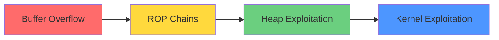

<div align="center">

# 🚩 CTF Challenge Collection


[](https://github.com/yourusername/CTF/stargazers)
[](https://github.com/yourusername/CTF/commits/main)
[](LICENSE)

**A comprehensive collection of Capture The Flag (CTF) challenges and writeups**

[🏆 Challenges](#-challenges) • [📊 Statistics](#-statistics) • [🛠️ Tools](#️-tools) • [📚 Resources](#-resources)

</div>

---

## 🎯 About This Repository

> *"In the world of cybersecurity, every challenge is an opportunity to learn and grow."*

This repository contains my personal journey through various CTF competitions, including detailed writeups, exploit scripts, and learning notes. Whether you're a beginner or an experienced player, you'll find valuable insights here.

### 🌟 What's Inside?

```ascii
┌─────────────────────────────────────────────────┐
│  📁 CTF Repository Structure                    │
├─────────────────────────────────────────────────┤
│  ├─ 🔐 Pwn/Binary Exploitation                  │
│  ├─ 🌐 Web Security                             │
│  ├─ 🔢 Cryptography                             │
│  ├─ 🔍 Reverse Engineering                      │
│  ├─ 🕵️ Forensics                                 │
│  └─ 🧩 Miscellaneous                            │
└─────────────────────────────────────────────────┘
```

---

## 📊 Statistics

<div align="center">

### 🏆 Achievement Dashboard

| Category | Challenges Solved | Difficulty Distribution |
|:--------:|:-----------------:|:----------------------:|
| 🔐 **Pwn** | 25 |  |
| 🌐 **Web** | 42 |  |
| 🔢 **Crypto** | 18 |  |
| 🔍 **Reverse** | 31 |  |
| 🕵️ **Forensics** | 22 |  |
| 🧩 **Misc** | 15 |  |

**Total Challenges: 153** | **Total Flags Captured: 🚩🚩🚩**

</div>

---

## 🚩 Challenges

<details open>
<summary><b>🔐 Pwn / Binary Exploitation</b> (Click to expand)</summary>

### Featured Challenges

| Challenge Name | CTF Event | Difficulty | Techniques | Writeup |
|:--------------|:----------|:----------:|:-----------|:-------:|
| Buffer Overflow 101 | PicoCTF 2024 | ⭐ Easy | Stack overflow, ret2win | [📝](./Pwn/buffer-overflow-101/README.md) |
| ROP Chains Master | HackTheBox CTF | ⭐⭐⭐ Hard | ROP, ASLR bypass | [📝](./Pwn/rop-chains/README.md) |
| Heap Exploitation | DEF CON Quals | ⭐⭐⭐⭐ Insane | UAF, Heap feng shui | [📝](./Pwn/heap-exploit/README.md) |

<div align="center">



</div>

</details>

<details>
<summary><b>🌐 Web Security</b></summary>

### Featured Challenges

| Challenge Name | CTF Event | Difficulty | Techniques | Writeup |
|:--------------|:----------|:----------:|:-----------|:-------:|
| SQL Injection Pro | OWASP CTF | ⭐⭐ Medium | Boolean-based SQLi | [📝](./Web/sql-injection/README.md) |
| XSS Heaven | Google CTF | ⭐⭐ Medium | Stored XSS, CSP bypass | [📝](./Web/xss-heaven/README.md) |
| SSRF Paradise | CyberDefenders | ⭐⭐⭐ Hard | SSRF to RCE | [📝](./Web/ssrf-paradise/README.md) |

</details>

<details>
<summary><b>🔢 Cryptography</b></summary>

### Featured Challenges

| Challenge Name | CTF Event | Difficulty | Techniques | Writeup |
|:--------------|:----------|:----------:|:-----------|:-------:|
| RSA Madness | CryptoHack | ⭐⭐ Medium | Small exponent attack | [📝](./Crypto/rsa-madness/README.md) |
| AES ECB Oracle | CryptoCTF | ⭐⭐⭐ Hard | ECB byte-at-a-time | [📝](./Crypto/aes-ecb/README.md) |
| Elliptic Curves | Google CTF | ⭐⭐⭐⭐ Insane | Invalid curve attack | [📝](./Crypto/elliptic/README.md) |

</details>

<details>
<summary><b>🔍 Reverse Engineering</b></summary>

### Featured Challenges

| Challenge Name | CTF Event | Difficulty | Techniques | Writeup |
|:--------------|:----------|:----------:|:-----------|:-------:|
| Crackme 101 | ReverseMe | ⭐ Easy | Static analysis | [📝](./Reverse/crackme-101/README.md) |
| Anti-Debug Master | FlareOn | ⭐⭐⭐ Hard | Anti-debugging, unpacking | [📝](./Reverse/anti-debug/README.md) |
| Obfuscation Hell | CSAW CTF | ⭐⭐⭐⭐ Insane | Code deobfuscation, VM | [📝](./Reverse/obfuscation/README.md) |

</details>

<details>
<summary><b>🕵️ Forensics</b></summary>

### Featured Challenges

| Challenge Name | CTF Event | Difficulty | Techniques | Writeup |
|:--------------|:----------|:----------:|:-----------|:-------:|
| Memory Dump Analysis | DFIR CTF | ⭐⭐ Medium | Volatility, memory forensics | [📝](./Forensics/memory-dump/README.md) |
| Network Traffic | CyberDefenders | ⭐⭐ Medium | Wireshark, pcap analysis | [📝](./Forensics/network/README.md) |
| Steganography Pro | StegoCTF | ⭐⭐⭐ Hard | LSB, metadata analysis | [📝](./Forensics/stego/README.md) |

</details>

---

## 🛠️ Tools & Environment

<div align="center">

### My CTF Arsenal

| Category | Tools |
|:---------|:------|
| **Pwn** | `pwntools` • `gdb-peda` • `ROPgadget` • `one_gadget` • `radare2` |
| **Web** | `Burp Suite` • `SQLMap` • `Nikto` • `OWASP ZAP` • `Postman` |
| **Crypto** | `SageMath` • `RsaCtfTool` • `hashcat` • `John the Ripper` • `CyberChef` |
| **Reverse** | `IDA Pro` • `Ghidra` • `x64dbg` • `dnSpy` • `Binary Ninja` |
| **Forensics** | `Volatility` • `Autopsy` • `Wireshark` • `binwalk` • `foremost` |

### 🐳 Docker Setup

```bash
# Quick setup for CTF environment
docker pull ubuntu:latest
docker run -it --name ctf-env ubuntu:latest
```

</div>

---

## 📚 Learning Resources

### 🎓 Recommended Platforms

<div align="center">

| Platform | Focus Area | Difficulty |
|:---------|:-----------|:----------:|
| [HackTheBox](https://hackthebox.com) | Pentesting, CTF | 🌶️🌶️🌶️ |
| [PicoCTF](https://picoctf.org) | Beginner-friendly | 🌶️ |
| [CryptoHack](https://cryptohack.org) | Cryptography | 🌶️🌶️ |
| [pwn.college](https://pwn.college) | Binary exploitation | 🌶️🌶️🌶️ |
| [OverTheWire](https://overthewire.org) | Linux, Security | 🌶️🌶️ |

</div>

### 📖 Essential Reading

- **[The Shellcoder's Handbook](https://www.wiley.com/en-us/The+Shellcoder%27s+Handbook%3A+Discovering+and+Exploiting+Security+Holes%2C+3rd+Edition-p-9781119183136)** - Binary exploitation bible
- **[The Web Application Hacker's Handbook](https://www.wiley.com/en-us/The+Web+Application+Hacker%27s+Handbook%3A+Finding+and+Exploiting+Security+Flaws%2C+2nd+Edition-p-9781118026472)** - Web security fundamentals
- **[Practical Malware Analysis](https://nostarch.com/malware)** - Reverse engineering guide
- **[Serious Cryptography](https://nostarch.com/seriouscrypto)** - Modern cryptography

---

## 🚀 Quick Start

### Prerequisites

```bash
# Install Python dependencies
pip install pwntools requests pycryptodome

# Install system tools (Debian/Ubuntu)
sudo apt update
sudo apt install gdb radare2 binutils python3-dev

# Install GDB enhancements
git clone https://github.com/pwndbg/pwndbg
cd pwndbg && ./setup.sh
```

### Usage

```bash
# Clone this repository
git clone https://github.com/yourusername/CTF.git
cd CTF

# Navigate to a challenge
cd Pwn/buffer-overflow-101

# Read the writeup
cat README.md

# Run the exploit
python3 exploit.py
```

---

## 📁 Repository Structure

```
CTF/
│
├── 🔐 Pwn/
│   ├── challenge-name/
│   │   ├── README.md          # Detailed writeup
│   │   ├── exploit.py         # Exploit script
│   │   ├── challenge-files/   # Binary, libc, etc.
│   │   └── screenshots/       # Visual aids
│   └── ...
│
├── 🌐 Web/
│   └── ...
│
├── 🔢 Crypto/
│   └── ...
│
├── 🔍 Reverse/
│   └── ...
│
├── 🕵️ Forensics/
│   └── ...
│
├── 🧩 Misc/
│   └── ...
│
├── 📚 Resources/
│   ├── cheatsheets/
│   ├── scripts/
│   └── notes/
│
└── README.md
```

---

## 🤝 Contributing

Contributions are welcome! If you have:
- ✨ Better solutions to existing challenges
- 🐛 Bug fixes for exploit scripts
- 📝 Improved writeups
- 🆕 New challenges to add

Please feel free to:
1. Fork the repository
2. Create a feature branch (`git checkout -b feature/amazing-solution`)
3. Commit your changes (`git commit -m 'Add amazing solution'`)
4. Push to the branch (`git push origin feature/amazing-solution`)
5. Open a Pull Request

---

## 📜 Writeup Template

Each challenge follows this structure:

```markdown
# Challenge Name

## Challenge Information
- **CTF**: Event Name
- **Category**: Pwn/Web/Crypto/Reverse/Forensics
- **Difficulty**: Easy/Medium/Hard/Insane
- **Points**: XXX
- **Solves**: XXX

## Description
[Challenge description]

## Solution
[Step-by-step solution]

## Flag
`flag{example_flag_here}`

## Lessons Learned
- Key takeaway 1
- Key takeaway 2

## References
- [Useful link 1]
- [Useful link 2]
```

---

## 🏆 Hall of Fame

<div align="center">

### Notable CTF Participations

| Event | Year | Rank | Team |
|:------|:----:|:----:|:-----|
| PicoCTF | 2024 | Top 100 | Solo |
| HackTheBox CTF | 2024 | Top 50 | Team |
| Google CTF | 2023 | Top 200 | Team |

</div>

---

## 📊 Contribution Graph

<div align="center">


</div>

---

## 💡 Tips & Tricks

<details>
<summary><b>🎯 For Beginners</b></summary>

1. **Start Simple**: Begin with easy challenges on PicoCTF or OverTheWire
2. **Read Writeups**: Learn from others' solutions
3. **Practice Consistently**: Dedicate time each week
4. **Join Communities**: Discord, Reddit r/securityCTF
5. **Take Notes**: Document what you learn

</details>

<details>
<summary><b>⚡ Pro Tips</b></summary>

- Always check for common vulnerabilities first
- Automate repetitive tasks with scripts
- Build a personal toolkit of frequently used exploits
- Stay updated with CVEs and security news
- Collaborate with others in team CTFs

</details>

---

## 🔗 Connect With Me

<div align="center">

[](https://github.com/yourusername)
[](https://twitter.com/yourusername)
[](https://linkedin.com/in/yourusername)
[](https://discord.gg/yourserver)

</div>

---

## 📝 License

This repository is licensed under the MIT License - see the [LICENSE](LICENSE) file for details.

---

## ⚠️ Disclaimer

<div align="center">

> **All challenges and writeups in this repository are for educational purposes only.**
> 
> The techniques and tools described should only be used in legal, authorized environments such as CTF competitions, authorized penetration testing, or your own systems. Unauthorized access to computer systems is illegal.

</div>

---

<div align="center">

### 🌟 If you found this helpful, consider giving it a star!

Made with ❤️ and ☕ by [Your Name]

**[⬆ Back to Top](#-ctf-challenge-collection)**

---


</div>
